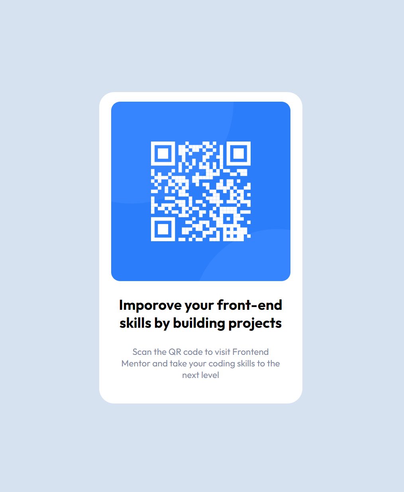

# Introduction

01001000 01100101 01101100 01101100 01101111 00100000 01100110 01110010 01101001 01100101 01101110 01100100, it was a very simple project that helped me organize my new knowledge about frontend mentor, github and github pages.

# Frontend Mentor - QR code component solution

This is a solution to the [QR code component challenge on Frontend Mentor](https://www.frontendmentor.io/challenges/qr-code-component-iux_sIO_H). Frontend Mentor challenges help you improve your coding skills by building realistic projects. 

## Table of contents

- [Intorduction](#introduction)
- [Overview](#overview)
  - [Screenshot](#screenshot)
  - [Links](#links)
- [My process](#my-process)
  - [Built with](#built-with)
  - [What I learned](#what-i-learned)
  - [Continued development](#continued-development)
- [Author](#author)
- [Acknowledgments](#acknowledgments)

## Overview

### Screenshot



### Links

- Live Site URL: [Github Pages](https://szeri323.github.io/projects/others/frontendmentor/QRCodeComponent/qr-code-component.html)
- Solution URL: [Frontend Mentor solution page](https://www.frontendmentor.io/solutions/sassscss-O7npxVZVwY)


## My process

### Built with

- Semantic HTML5 markup
- Mobile-first workflow
- Flexbox
- CSS Grid
- SCSS custom properties
- Sass/scss precomipler

### What I learned

The main goal was to implement a solution using SCSS. 
After submitting the solution, I got a tip to refactor the properties to scss and learned how to use them as in the example below:

```scss
$color-white: hsl(0, 0%, 100%);
$color-light-gray: hsl(212, 45%, 89%);
$color-grayish-blue: hsl(220, 15%, 55%);
$color-dark-blue: hsl(218, 44%, 22%);

body {
    font-family: 'Outfit', sans-serif;
    min-height: 100vh;
    display: grid;
    place-items: center;
    background-color: $color-light-gray;
}
```


### Continued development

I'm becoming more confident in coding simple frontend components, then I want to focus on more complex projects.

## Author

- My website - [My site](https://centerdiv.pl)
- Frontend Mentor - [@Szeri](https://www.frontendmentor.io/profile/Szeri323)


## Acknowledgments

Thanks to Daniel Moraes Mariz https://www.frontendmentor.io/profile/danielmrz-dev for advice on scss properties and how to use them.
